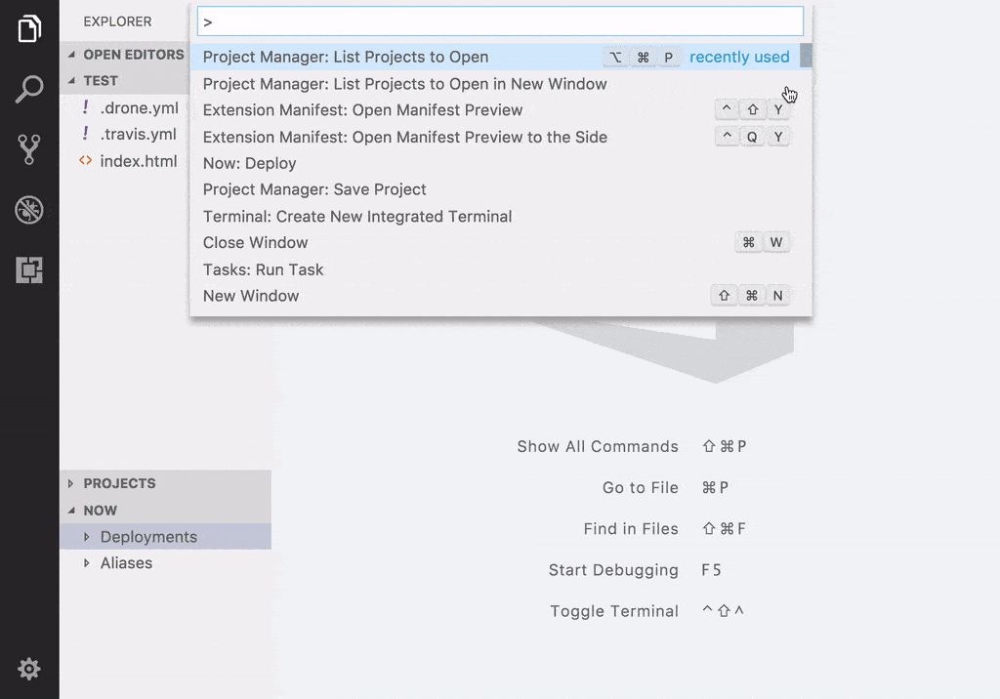
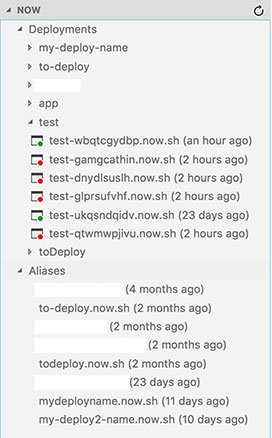
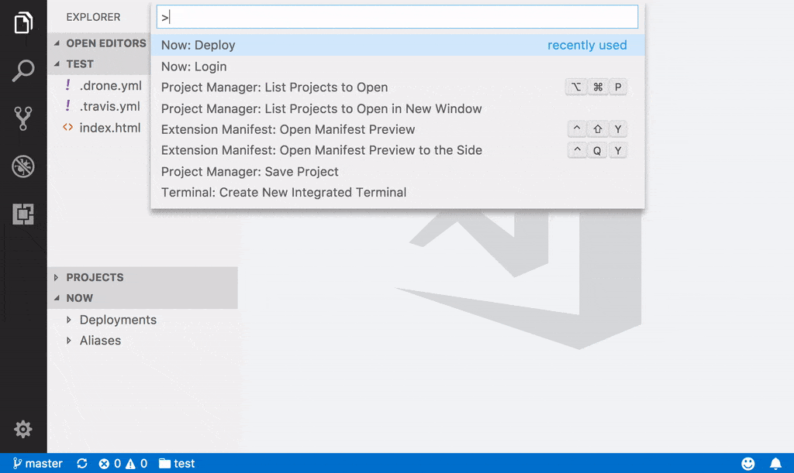
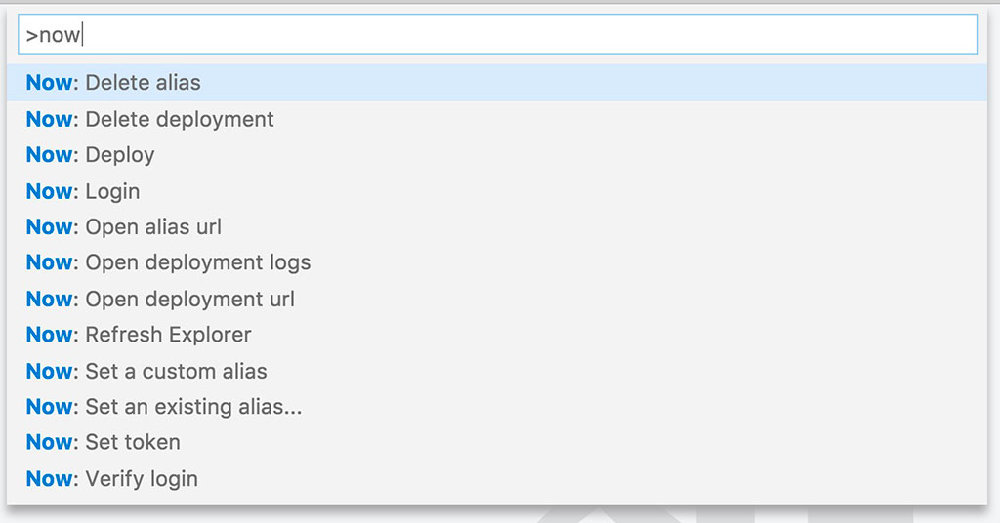

# ▲ZEIT now for Visual Studio Code

The Now extension makes it easy to create and manage [▲ZEIT now](https://zeit.co/now) deployments from Visual Studio Code.

## Features

* Authentication: request a login, verify login, set token
* Explorer: deployments and aliases lists
* Deployments: list, deploy a folder, set new or existing alias, delete, open in browser, open logs in browser
* Aliases: list, open in browser, delete

### Authentication



### Explorer



### Deployment



### Commands



## Requirements

A ▲ZEIT now account and a [token](https://zeit.co/account/tokens) are optional. You can create an account within VS Code with the `Login` command.

## Installation

* Install this extension
* Launch `Now : Login` within the Command Palette

## Extension Settings

If you want to turn the Explorer off for all workspaces, set the `showExplorer` configuration setting to `false`. Press `CMD+,` (or `CTRL+,` on Windows/Linux) to bring up the user level settings and add this to the right side:

```json
"now.showExplorer": false
```

## Release Notes

### 0.0.1

Initial release of vscode-now
